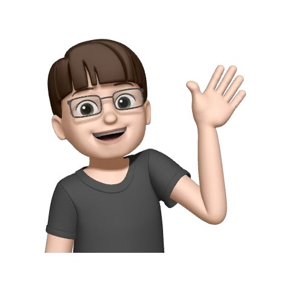
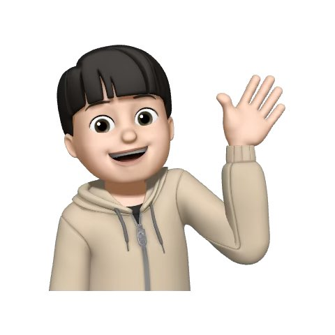
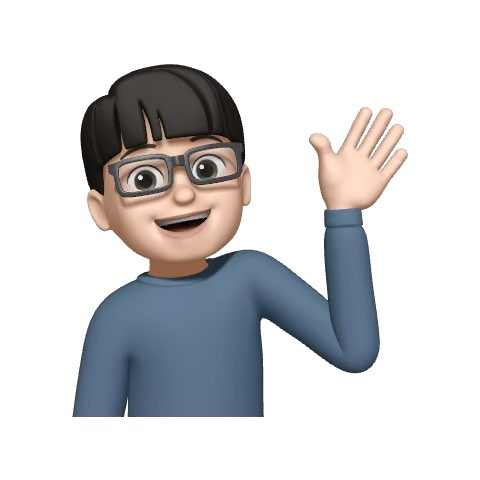
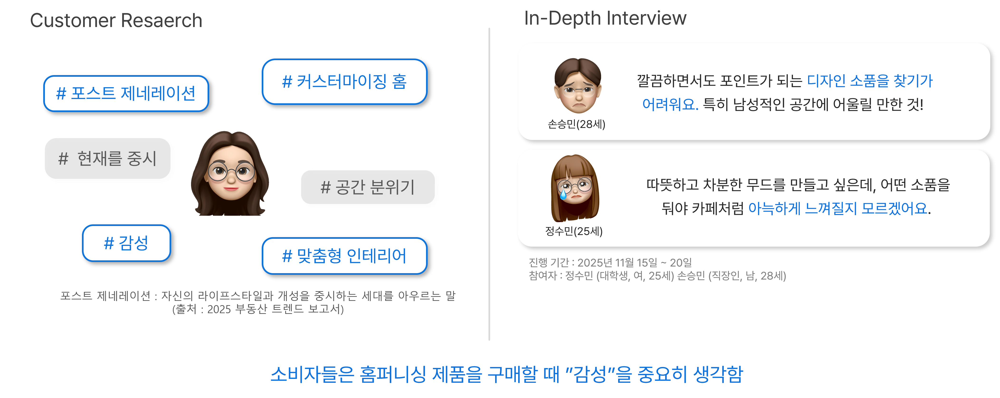
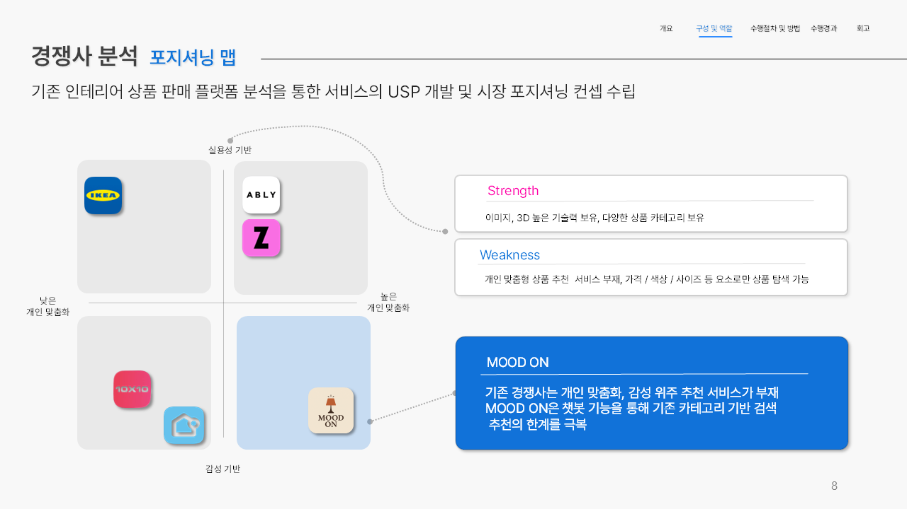
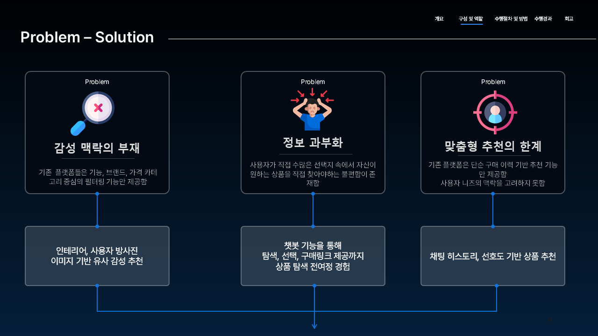
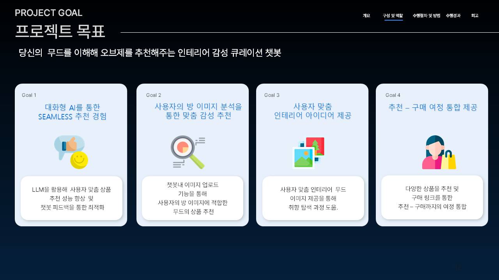
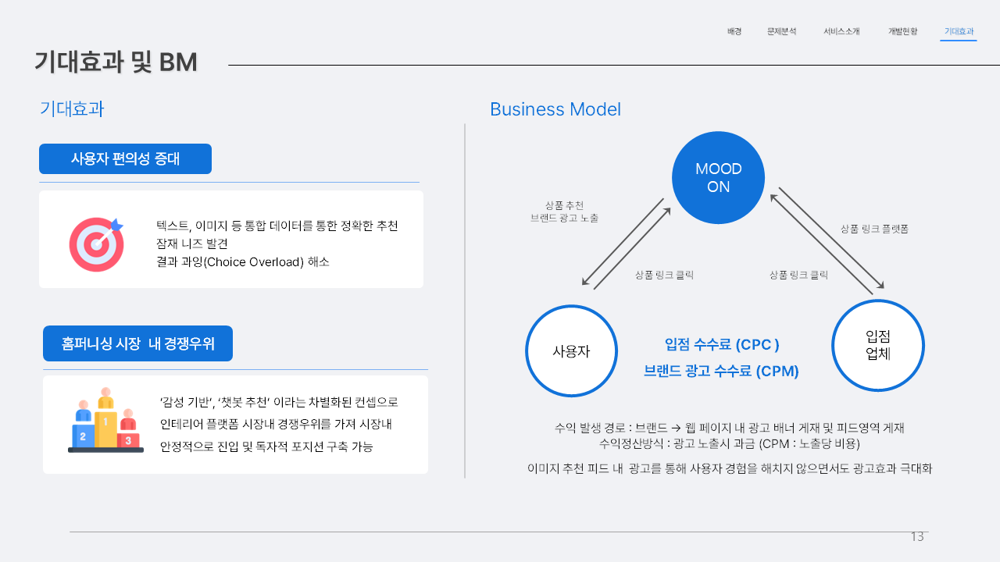
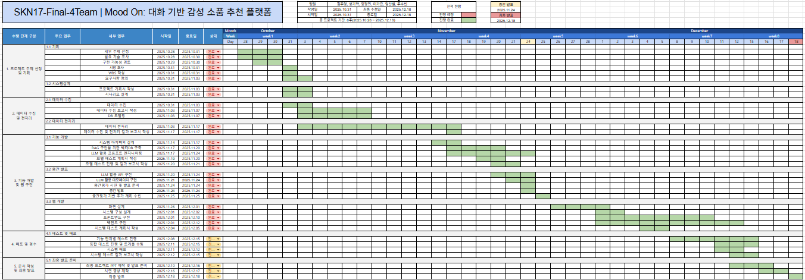

# SKN17 Final 4Team - MOOD ON

- **대주제**: LLM 활용 대화형 상품 추천
- **프로젝트 기간**: 25.10.28 ~ 25.12.18

 

# 🗂️ 목차

- [01. 팀 소개](#👥팀-소개)
- [02. 프로젝트 개요](#프로젝트-개요)
- [03. 기술 스택](#기술-스택)
- [04. WBS](#wbs)
- [05. 시스템 아키텍처](#시스템-아키텍처)
- [06. 데이터 설계](#데이터-설계)
- [07. 기능 및 화면 설계](#기능-및-화면-설계)
- [08. AI/추천 시스템 설계](#ai추천-시스템-설계)
- [09. 프로젝트 개선 노력](#프로젝트-개선-노력)
- [10. 수행 결과 및 시연 영상](#수행-결과-및-시연-영상)
- [11. 한 줄 회고](#한-줄-회고)

 
 

# 👥팀 소개

### 팀명: MOOD ON
> 당신의 무드를 이해해 오브제를 추천해주는 인테리어 감성 큐레이션 챗봇

### 팀원 소개
|[@김주영](https://github.com/samkim7788) | [@성기혁](https://github.com/venus241004) | [@양정민](https://github.com/Yangmin3) | [@이가은](https://github.com/Leegaeune) | [@임산별](https://github.com/ImMountainStar) |[@주수빈](https://github.com/Subin-Ju)|
|----------------------|----------------------|----------------------|----------------------|-----------------------|----------------------|
|  |  |  | <사진> | <사진> |  |

 
 

# 프로젝트 개요

## 프로젝트 명
- 🪴 **MOODON** - 당신의 무드를 이해해 오브제를 추천해주는 인테리어 감성 큐레이션 챗봇

## 프로젝트 배경
소비자들은 인테리어 제품을 구매할 때 단순히 가격과 브랜드와 같은 정략적인 요소만으로 선택하지 않습니다.  
인테리어는 그 공간을 대표하는 상품으로서 **감성**과 **분위기**같은 정성적인 요소가 중요한 요소로서 작용합니다.  
이러한 특성 때문에 소비자들은 자신이 원하는 무드와 어울리는 상품을 찾는 데 어려움을 겪곤 합니다. 
따라서 저희 팀은 인테리어 시장의 구조를 분석하고, 실제 소비자들이 겪는 불편함을 파악하여, 이 문제를 해결할 수 있는 인테리어  **상품 추천 챗봇**을 기획하고자 했습니다.   

### 타겟 시장

> 출처: 보스턴컨설팅그룹  

- 홈퍼니싱 시장
    - 정의: 개인의 취향과 감성에 맞게 공간을 꾸미는 인테리어 시장 
    - 특징: 낮은 진입장벽 & 높은 일반 소비자의 참여도  

홈퍼니싱 시장은 2018년 이후 꾸준히 성장 중이며,  
특히 코로나19를 기점으로 다양한 사회적 변화와 ‘집 꾸미기’ 트렌드의 확산에 영향을 받아  
기존 이커머스들(예: 오늘의집, 무신사·에이블리 등)까지 인테리어 카테고리를 확장할 만큼 대중적인 시장으로 자리 잡았습니다.

 

### 타겟 소비자

MOOD ON 서비스의 타겟 소비자는 바로 개성과 감성을 중시하는 **2030 ‘포스트 제너레이션’**입니다.  
이들은 집을 단순한 거주 공간을 넘어 자신의 취향을 드러내는 표현의 장으로 활용하는 특징을 갖고 있는 소비자들입니다.  
따라서 자신의 무드대로 공간을 적극적으로 커스터마이징하고, 감성 기반 인테리어에 대한 니즈가 특히 높은, **홈퍼니싱 시장의 주요 고객층**이라 볼 수 있습니다.  

실제 소비자의 특징과 불편함을 분석하기 위해 2명의 2030 소비자와 심층 인터뷰를 진행한 결과,  
이들은 방을 예쁘게 꾸미고 싶지만 **어떤 감성으로 꾸며야 할지, 어떤 게 어울리는지 찾지 못한다**는 막막함을 갖고 있었습니다.

 

### 소비자 분석
**pain point**
.png)
1. 초기 탐색 단계: 상품이 너무 많아 어떤 무드인지 판단 불가
2. 비교 탐색 단계: 원하는 분위기의 상품을 직접 찾아야 하는 번거로움
3. 구매 단계: 내 방, 나의 추구미와 일치하는지 확신 불가
4. 구매 후: 이미지와 실제 분위기 차이로 인한 실망  

→ **본인의 무드·취향을 스스로 정의하기 어려운 문제**에서 비롯되는 현상  

**Soulution**
.png)
1. 초기 탐색 단계: 이미지를 통한 무드 추출
2. 비교 탐색 단계: 사용자 채팅, 선호도 기반 맞춤 상품 추천
3. 구매 단계: 사용자 방 이미지 기반 맞춤 상품 추천
4. 구매 후: 3번을 통한 만족도 향상

 

### 경쟁사 분석

* 포지셔닝 맵 기준: **실용성** & **개인 맞춤화 수준**

분석한 결과, 현재 경쟁사들은 이미지 인식 기술, 방대한 상품 데이터, 추천 알고리즘 등 기술적 기능은 충분히 갖추고 있었습니다.  
그러나, 대부분의 경쟁사들이 가격·색상·카테고리 기반의  단편적인 필터링에 머물러 있습니다.  

즉, 현재 시장의 대부분은 실용성 중심의 추천이며,  
사용자가 원하는 무드까지 고려한 **취향 기반 추천 서비스**는 부재한 상황입니다.

 

## 프로젝트 목표
### 프로젝트 목표

저희 프로젝트의 최종 목표는 크게 4가지입니다.  

**첫째**, LLM을 활용해 사용자에게 SEAMLESS 추천 경험을 제공하고, 피드백을 받아 성능을 최적화합니다.  
**둘째**, 챗봇 내 이미지 업로드 기능을 통해 사용자의 방 이미지를 분석하여 맞춤 감성 추천을 돕습니다.  
**셋째**, 레퍼런스로 활용할 수 있는 무드 이미지를 제공해 사용자 맞춤 인테리어 아이디어를 제공합니다.  
**마지막**, 더 다양한 사이트의 상품을 추천하고 구매 링크를 제공하여 추천-구매 여정을 통합 수행합니다.  

### 기대효과 및 BM

**기대효과**
- 사용자 편의성 증대
- 홈퍼니싱 시장 내 경쟁 우위

**Business Model**
- 입점 수수료(CPC)
- 브랜드 광고 수수료(CPM)

 
 

# 기술 스택
| 카테고리 | 기술 스택 |
|----------|-------------------------------------------|
| **언어** |  |
| **프레임워크** |  |
| **벡터 데이터베이스** |  |
| **LLM 모델/프레임워크** |    |
| **VLM 모델** | 
| **임베딩 모델** |  |
| **데이터베이스** |   |
| **스토리지** |  |
| **통합 개발 환경** |   |
| **UI 및 프론트엔드** |    |
| **배포 및 컨테이너** |   |
| **실행 환경** |   |
| **협업 및 형상관리** |      |

 
 

# WBS
  

 
 

# 시스템 아키텍처

 
 

# 데이터 설계

 
 

# 기능 및 화면 설계

 
 

# AI/추천 시스템 설계

 
 

# 프로젝트 개선 노력

 
 

# 수행 결과 및 시연 영상

 
 

# 한 줄 회고
- 김주영: 
- 성기혁:
- 양정민: 
- 이가은: 
- 임산별: 
- 주수빈: 