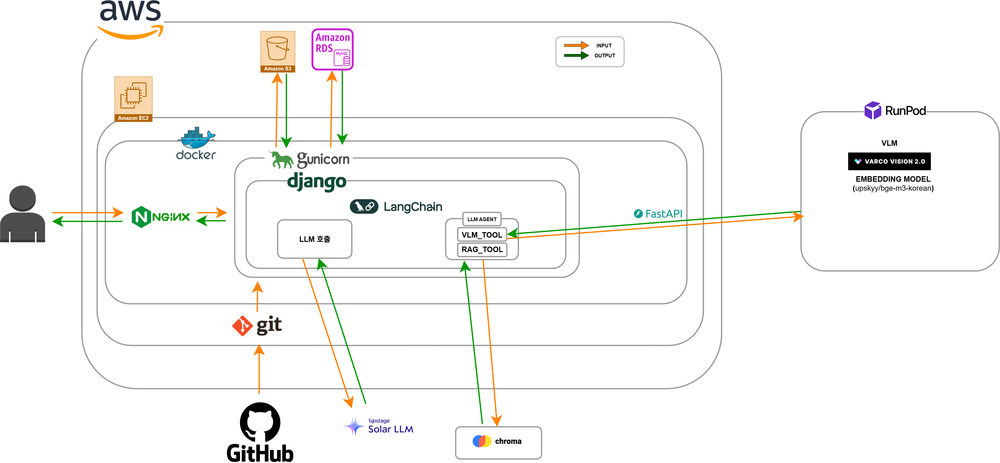

# SKN17 Final 4Team - MOOD ON

- **대주제**: LLM 활용 대화형 상품 추천
- **프로젝트 기간**: 25.10.28 ~ 25.12.18

 

# 🗂️ 목차

- [01. 팀 소개](#👥팀-소개)
- [02. 프로젝트 개요](#프로젝트-개요)
- [03. 기술 스택](#기술-스택)
- [04. WBS](#wbs)
- [05. 시스템 아키텍처](#시스템-아키텍처)
- [06. 데이터 설계](#데이터-설계)
- [07. 기능 및 화면 설계](#기능-및-화면-설계)
- [08. AI/추천 시스템 설계](#ai추천-시스템-설계)
- [09. 프로젝트 개선 노력](#프로젝트-개선-노력)
- [10. 수행 결과 및 시연 영상](#수행-결과-및-시연-영상)
- [11. 한 줄 회고](#한-줄-회고)

 
 

# 👥팀 소개

### 팀명: MOOD ON
> 당신의 무드를 이해해 오브제를 추천해주는 인테리어 감성 큐레이션 챗봇

### 팀원 소개
|[@김주영](https://github.com/samkim7788) | [@성기혁](https://github.com/venus241004) | [@양정민](https://github.com/Yangmin3) | [@이가은](https://github.com/Leegaeune) | [@임산별](https://github.com/ImMountainStar) |[@주수빈](https://github.com/Subin-Ju)|
|----------------------------------------- ---------------------------------------|------------------------------------------|------------------------------------------|----------------------------------------|
| <사진> | <사진> | <사진> | <사진> | <사진> | <사진> |

 

# 프로젝트 개요

### 프로젝트 명
- 🪴 **MOODON** - 당신의 무드를 이해해 오브제를 추천해주는 인테리어 감성 큐레이션 챗봇

### 프로젝트 배경

### 소비자 분석

### 경쟁사 분석

 

# 기술 스택
| 카테고리 | 기술 스택 |
|----------|-------------------------------------------|
| **언어** |  |
| **프레임워크** |  |
| **벡터 데이터베이스** |  |
| **LLM 모델/프레임워크** |    |
| **VLM 모델** | 
| **임베딩 모델** |  |
| **데이터베이스** |   |
| **스토리지** |  |
| **통합 개발 환경** |   |
| **UI 및 프론트엔드** |    |
| **배포 및 컨테이너** |   |
| **실행 환경** |   |
| **협업 및 형상관리** |      |

 

# WBS
  

 

# 시스템 아키텍처

 

# 데이터 설계

 

# 기능 및 화면 설계

 

# AI/추천 시스템 설계

 

# 프로젝트 개선 노력

 

# 수행 결과 및 시연 영상

 

# 한 줄 회고
- 김주영: 
- 성기혁:
- 양정민: 
- 이가은: 
- 임산별: 
- 주수빈: 